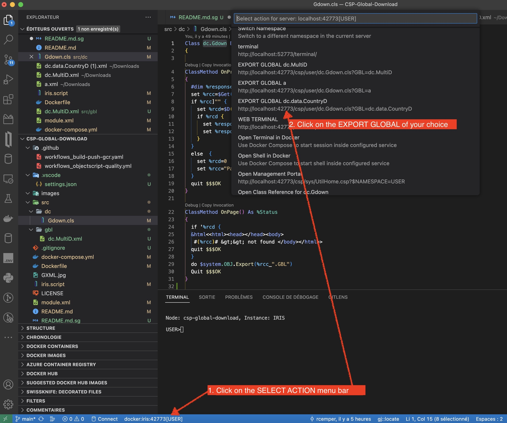

This is the Python client for IRIS NativeAPI Command Extension   
It demonstrates using the extension without ObjectScript   

For easy testing an IRIS instance with a demo Global and    
a pre-installed NativeAPI Command Line Extension is added. 
### Prerequisites    
Make sure you have [git](https://git-scm.com/book/en/v2/Getting-Started-Installing-Git) and [Docker desktop](https://www.docker.com/products/docker-desktop) installed.    
### Installation   
Clone/git pull the repo into any local directory  

````    
git ttps://github.com/rcemper/CSP-Global-Download   
````    
   
Run the IRIS container with your project:   

````
docker-compose up -d --build    
````
### How to Test it    

in your browser call  [http://localhost:42773/csp/user/dc.Gdown.cls?GBL=dc.MultiD
](http://localhost:42773/csp/user/dc.Gdown.cls?GBL=dc.MultiD)   
and you get the file select menu for the download    


# Demo


[Article in DC](https://community.intersystems.com/post/download-globals-xml-using-csp)
